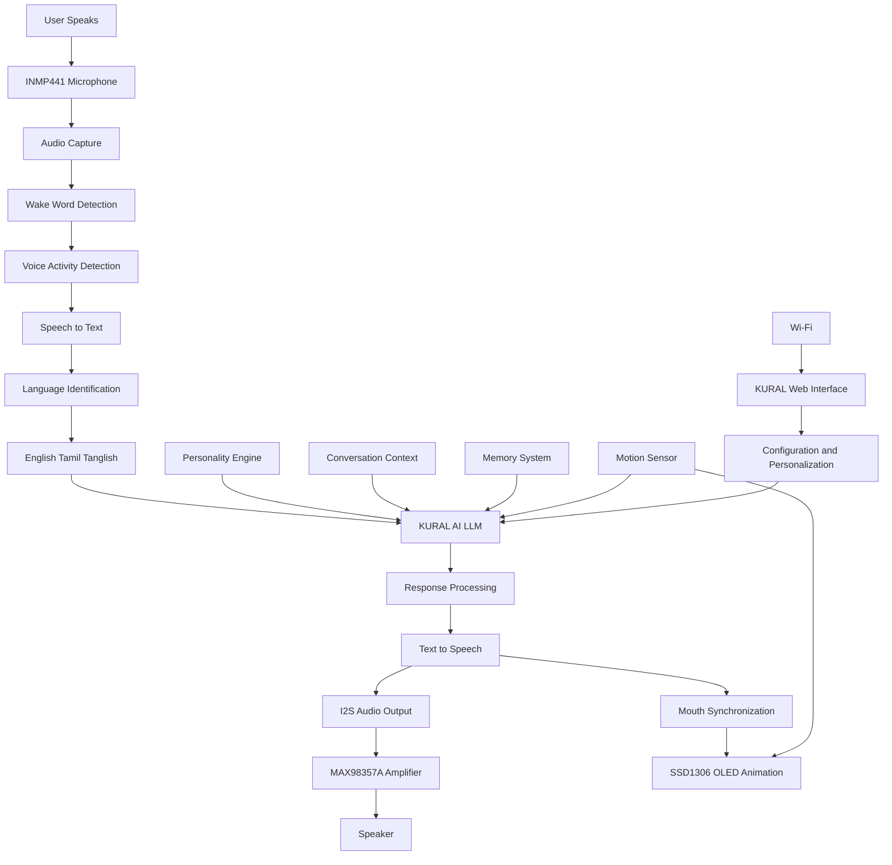

# KURAL – AI-Powered Interactive Desktop Companion

> **An AI-powered interactive toy inspired by the traditional Thanjavur Thalaiyati Bommai, combining cultural heritage, voice AI, embedded systems, and intelligent interaction.**

**Team:** CODE CRUSADERS_2  
**Hackathon:** Smart India Hackathon 2026 (SIH 2026)


## 📖 Project Overview

**KURAL** is an AI-powered interactive desktop companion inspired by the traditional **Thanjavur Thalaiyati Bommai**.

The project combines **traditional Indian cultural design with modern Artificial Intelligence, voice interaction, embedded systems, and interactive hardware** to create a more natural and engaging human–AI experience.

KURAL is designed to listen to the user, understand their speech, process the request using an AI system, generate an appropriate response, and communicate the response through speech and visual animations.

The system is designed to support **English, Tamil, and Tanglish**, allowing users to interact with KURAL in a more natural and familiar way.

The current prototype integrates external AI services for speech recognition, AI processing, and text-to-speech, while the long-term vision is to develop a **customized KURAL-specific AI/LLM system**.

### 🎯 Core Interaction

```text
User Speech
     ↓
Wake Word Detection
     ↓
Voice Activity Detection
     ↓
Speech-to-Text
     ↓
Language Identification
     ↓
KURAL AI / LLM
     ↓
Response Processing
     ↓
Text-to-Speech
     ↓
Audio Output
     ↓
OLED Animation & Interaction
```
## ✨ Features

| Feature | Description | Purpose |
|---|---|---|
| 🎙️ Voice Interaction | Allows users to communicate with KURAL using natural speech. | Enables intuitive human–AI interaction |
| 🗣️ Speech Recognition | Converts spoken input into text using the speech-to-text pipeline. | Understands user commands and questions |
| 🌐 Multilingual Support | Designed to support English, Tamil, and Tanglish. | Makes KURAL accessible to a wider range of users |
| 🧠 AI-Powered Responses | Processes user input through the KURAL AI / LLM layer. | Generates intelligent and context-aware responses |
| 😊 Personality Engine | Provides KURAL with a consistent conversational personality and response style. | Creates a more engaging companion experience |
| 💬 Conversation Context | Maintains relevant conversational context during interactions. | Enables more natural multi-turn conversations |
| 💾 Memory System | Supports short-term context and a planned long-term memory architecture. | Enables personalization and continuity |
| 🔊 Text-to-Speech | Converts generated responses into speech. | Allows KURAL to communicate naturally through voice |
| 👁️ OLED Interaction | Displays visual states such as idle, listening, thinking, and speaking. | Provides visual feedback during interaction |
| 👄 Mouth Synchronization | Coordinates OLED mouth animations with speech output. | Makes KURAL appear more expressive |
| 🌀 Motion Interaction | Uses a motion sensor to detect movement, tilt, and orientation. | Enables physical interaction with the companion |
| 📶 Wi-Fi Provisioning | Provides a setup mechanism for configuring Wi-Fi connectivity. | Simplifies initial device configuration |
| 💻 Web Interface | Planned web interface for configuration, personalization, memory, and system information. | Provides a convenient control interface |
| 🔐 Privacy & User Control | Designed with user control over personalization and memory in mind. | Supports safer and more controlled interaction |

## 🛠️ Technology Stack

| Category | Technologies |
|---|---|
| 🔧 Microcontroller | ESP32 |
| 💻 Firmware | Arduino / C++ |
| 🎙️ Microphone | INMP441 MEMS Microphone |
| 🎧 Audio Interface | I2S |
| 🗣️ Speech-to-Text | Sarvam AI |
| 🧠 AI Processing | External AI / LLM API |
| 🔊 Text-to-Speech | Sarvam AI Bulbul |
| 🔉 Audio Amplifier | MAX98357A I2S Mono Amplifier |
| 🖥️ Display | 0.96" SSD1306 OLED |
| 🌀 Motion Sensor | LSM6DSO / MPU6050 |
| 📶 Connectivity | Wi-Fi |
| 🌐 Device Configuration | ESP32 Web Server |
| 💾 Configuration Storage | ESP32 Preferences / NVS |
| 🌍 Languages | English, Tamil & Tanglish |

# 🏗️ Architecture

## 🔄 Complete Software Workflow

The KURAL interaction pipeline follows a structured sequence from voice input to intelligent response and physical interaction.


## 🎤 Voice & Language Processing

KURAL uses an integrated voice and language processing pipeline to capture user speech, recognize the spoken content, identify the interaction language, and pass the input to the AI processing layer.

### 🎙️ Voice & Language Pipeline

```text
User Speech
     ↓
INMP441 MEMS Microphone
     ↓
I2S Audio Capture
     ↓
Wake Word Detection
     ↓
Voice Activity Detection
     ↓
Speech-to-Text
     ↓
Language Identification
     ↓
English / Tamil / Tanglish
     ↓
KURAL AI / LLM
     ↓
Response Processing
     ↓
Text-to-Speech
     ↓
Voice Response

```

## 😊 Personality & Conversation Context

KURAL is designed to provide a consistent conversational experience by combining a defined personality with relevant conversation context.

### 😊 Personality Engine

The Personality Engine defines how KURAL communicates with the user.

It works alongside the AI / LLM layer to influence:

- Response style
- Conversational behavior
- Interaction tone
- Personality consistency
- User interaction experience

The personality instructions are provided to the AI along with the user's input and other relevant context.

### 💬 Conversation Context

The Conversation Context layer maintains relevant information from the ongoing interaction.

This allows KURAL to understand the relationship between different messages in a conversation instead of treating every input as an isolated request.

```text
User Input
     ↓
Language Information
     ↓
Conversation Context
     ↓
Personality Instructions
     ↓
KURAL AI / LLM
     ↓
Context-Aware Response
```

## 💾 Memory System

KURAL is designed with a memory architecture that works alongside its conversation context and AI processing layers.

### Short-Term Memory

Maintains relevant information from the current conversation so that KURAL can understand follow-up questions and maintain conversational continuity.

### Long-Term Memory

A planned extension of the system will allow KURAL to retain selected user preferences and useful information across conversations.

### Privacy & User Control

The memory architecture is designed with user control and privacy in mind, allowing memory-related functionality to be developed around controlled information retention.

> **Current Status:** Short-term conversational context is part of the interaction architecture, while advanced long-term memory is planned for future development.

## 👁️ OLED Interaction

KURAL uses a **0.96-inch SSD1306 OLED display** as its visual interaction layer.

The display provides immediate feedback about what KURAL is doing, allowing the user to understand the device state without relying only on audio.

### Display States

| State | Visual Feedback |
|---|---|
| 💤 Idle | KURAL waits for interaction |
| 👂 Listening | Indicates that KURAL is receiving voice input |
| 🧠 Thinking | Indicates that the AI is processing the request |
| 🗣️ Speaking | Displays an active speaking expression |

### 🎭 Interactive Expressions

The OLED can display animated expressions during interaction. During speech output, the animation can be coordinated with the generated audio to provide **mouth synchronization**.

This creates a more lively interaction between the physical KURAL companion and the user.

> **Display:** 0.96" SSD1306 OLED  
> **Interaction:** Status animations + expressions + mouth synchronization

## 📁 Project Structure

```text
KURAL/
│
├── firmware/              # ESP32 firmware
│   ├── src/               # Main firmware source
│   ├── include/           # Header files
│   └── platformio.ini     # PlatformIO configuration
│
├── web/                   # KURAL web interface
│
├── python/                # Voice / AI development utilities
│
├── docs/                  # Project documentation
│
├── screenshots/           # README screenshots
│
├── README.md              # Project documentation
└── LICENSE                # Project license
```

## 🚀 Setup & Installation

### 📋 Prerequisites

Before setting up KURAL, make sure the required hardware and software components are available.

**Hardware**
- ESP32 development board
- INMP441 MEMS microphone
- MAX98357A I2S amplifier
- Speaker
- SSD1306 OLED display
- Motion sensor
- USB cable and power source

**Software**
- Arduino IDE or PlatformIO
- ESP32 board support
- Required firmware libraries
- Wi-Fi network
- Required AI / speech service configuration

## 🔐 Security

KURAL is designed with basic security and privacy considerations for device configuration, credentials, AI services, and user data.

### 🔑 Credential Protection

Sensitive information such as:

- Wi-Fi passwords
- API keys
- Authentication credentials
- User-specific configuration

should not be hard-coded into the source code or committed to the public repository.

### 💾 Local Configuration

Wi-Fi configuration is stored using the ESP32's **Preferences / NVS** storage mechanism rather than being exposed directly in the source code.

### 🌐 Device Access

The ESP32 web interface should be used within the intended local network environment, with future development able to introduce stronger authentication and access controls.

### 🧠 Memory Privacy

As KURAL's memory capabilities evolve, user control and privacy should remain part of the memory architecture.

> **Security principle:** Keep credentials private, minimize unnecessary data exposure, and give users control over stored information.

## 📊 Current Prototype vs Planned System

| Area | Current Prototype | Planned KURAL System |
|---|---|---|
| 🎙️ Voice Input | INMP441 + I2S audio capture | Improved voice pipeline |
| 🔑 Wake Word | KURAL wake-word concept | More robust wake-word system |
| 🗣️ Speech-to-Text | Sarvam AI STT | Improved / finalized STT solution |
| 🌐 Languages | English, Tamil & Tanglish | Enhanced multilingual understanding |
| 🧠 AI Processing | External AI / LLM service | Customized KURAL AI / LLM |
| 😊 Personality | Defined interaction personality | Deeper KURAL personality integration |
| 💬 Context | Conversation context | Advanced context management |
| 💾 Memory | Context-based memory architecture | Long-term personalized memory |
| 🔊 Text-to-Speech | Sarvam Bulbul | Refined / finalized TTS solution |
| 👁️ OLED | SSD1306 visual interaction | More expressive animations |
| 👄 Mouth Sync | Prototype interaction | Improved speech synchronization |
| 🌀 Motion | LSM6DSO / MPU6050 | Advanced motion interaction |
| 📶 Connectivity | ESP32 Wi-Fi | Expanded device connectivity |
| 💻 Web Interface | Provisioning / planned interface | Full KURAL management dashboard |
| 🔐 Privacy | Basic configuration protection | Enhanced privacy and user control |
| 📴 Offline Capability | Limited | Offline capabilities where feasible |

## 🔮 Roadmap

KURAL is being developed as an evolving platform, with the current prototype serving as the foundation for future capabilities.

### 🟢 Phase 1 — Prototype

- ESP32-based hardware platform
- Voice input through INMP441
- Wake-word interaction
- Speech-to-Text integration
- English, Tamil and Tanglish support
- External AI / LLM integration
- Sarvam Bulbul Text-to-Speech
- SSD1306 OLED interaction
- Wi-Fi provisioning

### 🟡 Phase 2 — Intelligence & Interaction

- Customized KURAL AI / LLM
- Improved conversation context
- Long-term memory
- Enhanced personality system
- Improved Tamil and Tanglish interaction
- Better wake-word detection
- Improved OLED expressions
- Enhanced mouth synchronization
- Expanded motion interaction

### 🔵 Phase 3 — KURAL Ecosystem

- Full KURAL web dashboard
- User profiles and personalization
- Device monitoring and configuration
- Smart-device interaction
- Improved privacy and security
- Offline capabilities where feasible
- Further optimization of the complete KURAL platform

> **Vision:** Evolve KURAL from an AI-enabled prototype into a personalized, interactive companion that combines cultural identity, embedded technology, and intelligent communication.

## 🎨 KURAL Concept Visuals

The following AI-generated visuals represent the **design vision and conceptual appearance of KURAL**, an interactive companion inspired by the traditional Thanjavur Thalaiyati Bommai.

### 🌟 KURAL Concept

<p align="center">
  
</p>

### 🔄 KURAL Design Views

<p align="center">
  
</p>

> **Note:** These visuals are AI-generated concept representations created to communicate the intended design and interaction vision. They do not represent photographs of the physical prototype.

## 🌟 Why KURAL?

KURAL brings together **cultural heritage and modern technology** in the form of an interactive AI companion.

Inspired by the traditional **Thanjavur Thalaiyati Bommai**, KURAL reimagines a familiar cultural form through voice AI, embedded systems, visual interaction, and intelligent conversation.

### What makes KURAL different?

- 🇮🇳 **Cultural Identity** — Inspired by a traditional Tamil cultural icon.
- 🧠 **Intelligent Interaction** — Designed to understand and respond to natural user conversations.
- 🗣️ **Multilingual Communication** — Supports English, Tamil, and Tanglish interaction.
- 👁️ **Physical Expression** — Combines voice, OLED animations, and interactive hardware.
- 💬 **Personalized Experience** — Designed with personality, context, and memory capabilities.
- 🔧 **Embedded AI** — Brings AI interaction into a physical desktop companion.
- 🚀 **Future-Ready Architecture** — Designed to evolve toward a customized KURAL AI system.

> **KURAL's vision is to preserve cultural identity while exploring how modern AI can create a more natural and interactive relationship between people and technology.**

## ❤️ Conclusion

KURAL represents an exploration of how **Artificial Intelligence, embedded systems, voice interaction, and cultural heritage** can come together to create a meaningful interactive companion.

Inspired by the traditional **Thanjavur Thalaiyati Bommai**, KURAL combines a physical form with conversational AI, multilingual interaction, audio processing, OLED-based expressions, and intelligent interaction.

The current prototype establishes the foundation for the system, while the planned architecture provides a path toward a more personalized and customized **KURAL AI ecosystem**.

> **KURAL — Where Culture Meets Intelligence.**
